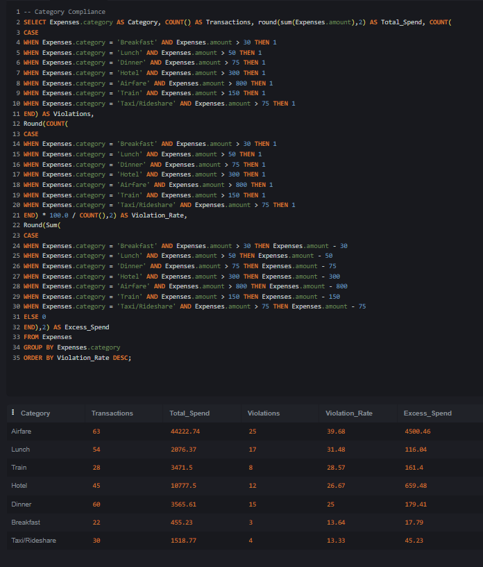
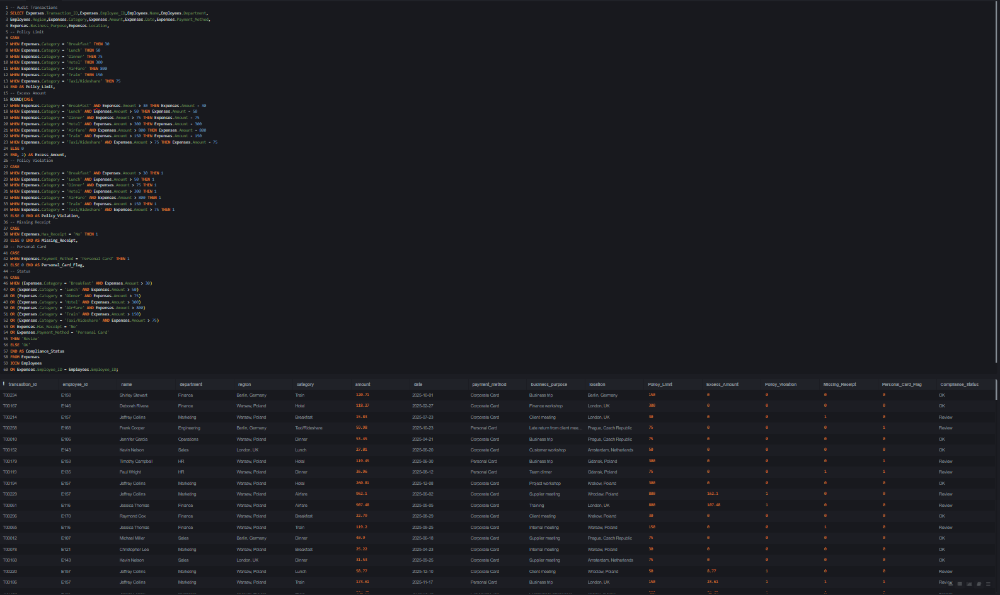
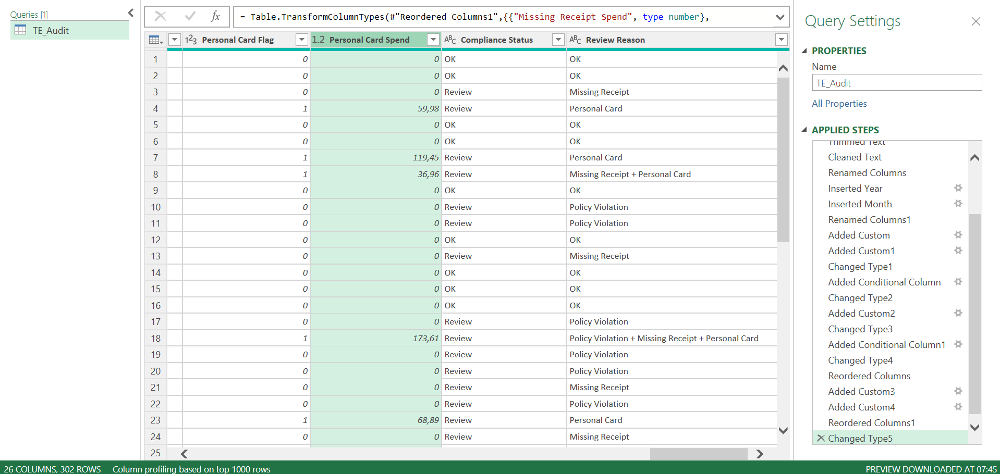
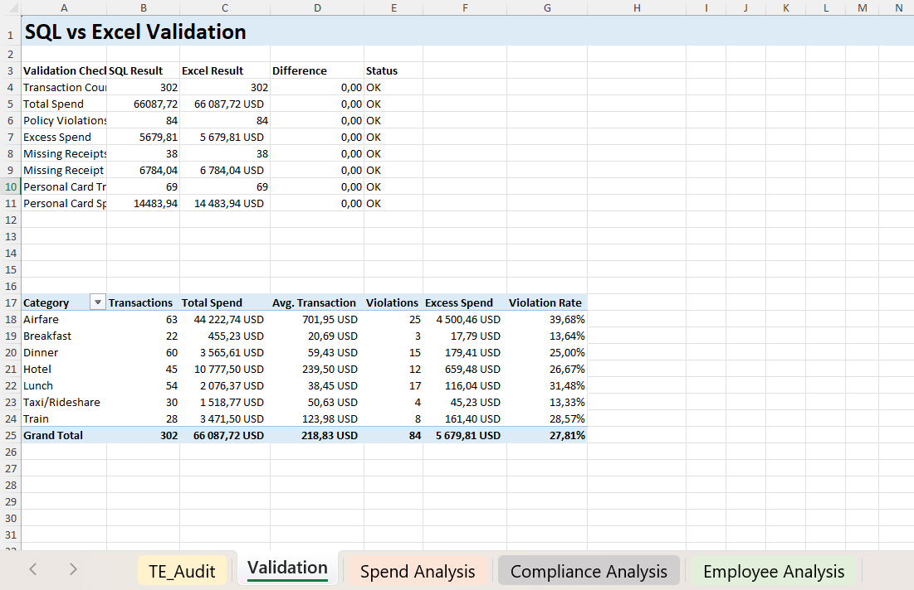
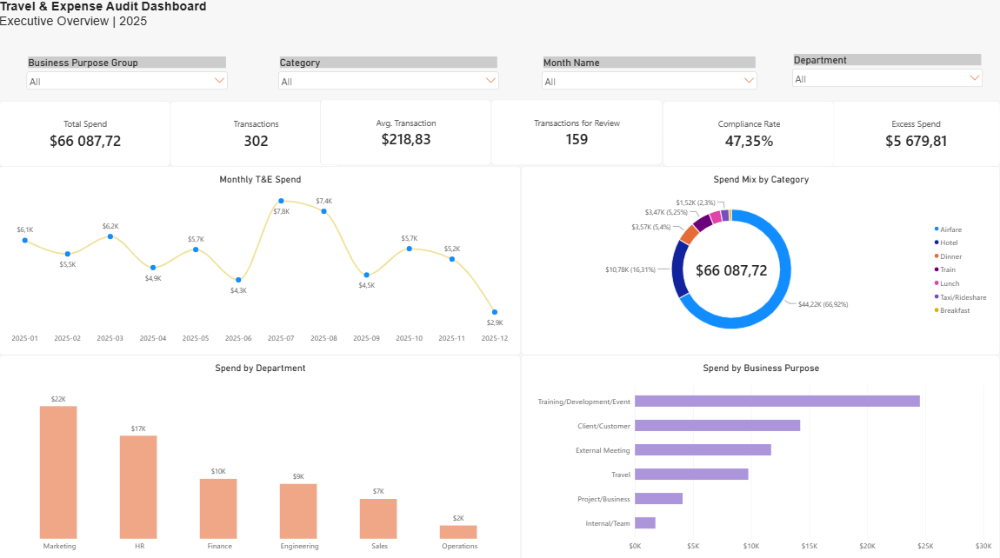
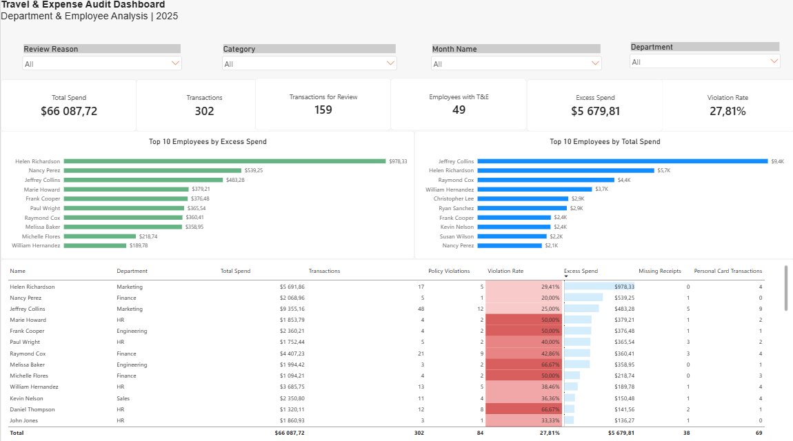

# Travel & Expense Audit Analytics

End-to-end finance analytics portfolio project focused on **Travel & Expense (T&E) audit, policy compliance, exception analysis, and management reporting**.

The project follows a full analytical workflow:

**Raw Data → SQL Audit Logic → Power Query Transformation → Excel Validation & Analysis → Power BI Reporting**

The dataset is **synthetic** and was created specifically for portfolio and learning purposes.

---

## Project Objective

The goal of this project was to simulate a practical finance analyst workflow and answer questions such as:

- How much did the company spend on travel and expenses?
- Which expense categories drive the most spend?
- Where are policy violations occurring?
- Which departments and employees create the greatest financial exposure?
- How much spend exceeds policy limits?
- How often are receipts missing?
- How frequently are personal cards used?
- Which transactions should be prioritized for review?
- How do spend and compliance trends change over time?

The project was designed to combine **financial controls, data validation, SQL analysis, Excel, Power Query, and Power BI** in one coherent business case.

---

## Tools Used

- **SQL / SQLite**
  - joins
  - `CASE` statements
  - aggregations
  - subqueries
  - compliance calculations
  - exception identification

- **Power Query**
  - data cleaning
  - column typing
  - text cleaning
  - date transformations
  - business-purpose grouping
  - review-reason classification
  - preparation of the final analytical dataset

- **Microsoft Excel**
  - PivotTables
  - formulas
  - SQL-to-Excel reconciliation
  - spend analysis
  - compliance analysis
  - employee-level analysis
  - charts

- **Power BI**
  - DAX measures
  - KPI cards
  - slicers
  - conditional formatting
  - Top N analysis
  - management dashboards
  - transaction-level investigation

---

## Dataset

The project uses two synthetic source datasets:

### Employees

Employee-level master data including:

- Employee ID
- Name
- Department
- Job Title
- Region
- Employment Type

### Expenses

Transaction-level T&E data including:

- Transaction ID
- Employee ID
- Category
- Amount
- Date
- Merchant
- Receipt status
- Payment method
- Business purpose
- Location

The final analysis covers **302 expense transactions from 2025**.

---

## Expense Policy Rules

The following policy limits were used to identify transactions exceeding allowed thresholds:

| Category | Policy Limit |
|---|---:|
| Breakfast | $30 |
| Lunch | $50 |
| Dinner | $75 |
| Hotel | $300 |
| Airfare | $800 |
| Train | $150 |
| Taxi / Rideshare | $75 |

A transaction may require review because of:

- a policy-limit violation
- a missing receipt
- personal-card usage
- a combination of these issues

---

## Project Workflow

### 1. Raw Data

The project begins with employee and expense source files.

The source data is stored in:

```text
data/
├── Employees.csv
└── Expenses.csv
```

---

### 2. SQL Analysis & Audit Logic

SQL was used first to understand the data and build the audit logic.

The analysis covers:

1. Total T&E Spend
2. Spending by Category
3. Average Transaction Amount by Category
4. Department Compliance
5. Receipt Compliance
6. Personal Card Usage
7. Employee Exceptions
8. Category Compliance
9. Monthly Compliance

The final SQL query joins employee and expense data and creates audit fields including:

- `Policy_Limit`
- `Excess_Amount`
- `Policy_Violation`
- `Missing_Receipt`
- `Personal_Card_Flag`
- `Compliance_Status`

SQL files:

```text
sql/
├── analysis.sql
├── audit_transactions.sql
└── TE_Audit_SQL_Output.csv
```

### SQL — Category Compliance



### SQL — Audit Transactions



---

### 3. Power Query Transformation

The SQL audit output was transformed in Power Query to prepare the final analytical dataset.

Main transformation steps included:

- promoting headers
- setting data types
- trimming and cleaning text
- renaming columns
- extracting year and month
- creating Year-Month
- creating Month Name
- creating Receipt Status
- creating Review Reason
- grouping Business Purpose
- creating Missing Receipt Spend
- creating Personal Card Spend
- reordering and finalizing columns

Final dataset:

```text
power-query/
└── TE_Audit_Cleaned.xlsx
```

### Power Query Transformation



---

### 4. Excel Validation & Analysis

Excel was used as an independent validation and analysis layer.

The workbook contains:

- SQL vs Excel validation
- spend analysis
- compliance analysis
- employee analysis
- PivotTables
- charts

The SQL results were reconciled against Excel calculations to confirm that the main KPIs matched.

```text
excel/
└── TE_Analysis.xlsx
```

### SQL vs Excel Validation



---

### 5. Power BI Dashboard

The Power BI report contains four analytical pages.

#### Executive Overview

High-level management view of:

- Total Spend
- Transactions
- Average Transaction
- Transactions for Review
- Compliance Rate
- Excess Spend
- Monthly Spend
- Category Mix
- Department Spend
- Business Purpose Spend



#### Policy & Compliance

Focused on:

- Review Rate
- Policy Violations
- Excess Spend
- Missing Receipt Rate
- Personal Card Rate
- Review Reasons
- Violation Rate by Department
- Violation Rate by Category
- Monthly Violation Rate

#### Department & Employee Analysis

Focused on identifying departments and employees with the highest spend and compliance exposure.

Includes:

- Employees with T&E
- Top 10 Employees by Excess Spend
- Top 10 Employees by Total Spend
- employee-level compliance table
- violation rates
- missing receipts
- personal-card transactions



#### Transaction Investigation

Transaction-level review page with filters for:

- Review Reason
- Category
- Department
- Employee
- Month
- Compliance Status

The table provides transaction-level visibility into policy limits, excess spend, receipt status, payment method, business purpose, and review reason.

Power BI file:

```text
power-bi/
└── TE_Audit_Dashboard.pbix
```

---

## Key Findings

The analysis identified several important T&E trends.

### Overall Spend & Review

- **302 transactions**
- **$66,087.72 total T&E spend**
- **$218.83 average transaction**
- **159 transactions required review**
- **52.65% review rate**
- **47.35% compliance / OK rate**

### Policy Violations

- **84 policy violations**
- **27.81% violation rate**
- **$5,679.81 excess spend**

### Spend Concentration

- **Airfare accounted for 66.92% of total spend**
- **Airfare + Hotel represented approximately 83.23% of total spend**
- Airfare generated approximately **79.2% of all excess spend**

This indicates that a relatively small number of high-value travel categories drive most of the financial exposure.

### Department Risk

- **HR had the highest policy violation rate: 37.88%**
- **Marketing generated the highest excess spend: $1,647.57**
- **Operations had a 0% policy violation rate**

This demonstrates an important distinction between **frequency of violations** and **financial materiality**.

### Receipts & Payment Method

- **38 transactions had missing receipts**
- **12.58% missing receipt rate**
- **$6,784.04 of spend was associated with missing receipts**
- **69 transactions used personal cards**
- **22.85% personal card rate**
- **$14,483.94 of spend was paid using personal cards**

### Employee Exceptions

The employee with the highest excess spend was:

**Helen Richardson — $978.33**

The employee with the highest total spend was:

**Jeffrey Collins — approximately $9.36K**

This again shows that the highest spender is not necessarily the employee creating the highest policy exposure.

---

## Repository Structure

```text
travel-expense-audit-analytics/
│
├── data/
│   ├── Employees.csv
│   └── Expenses.csv
│
├── sql/
│   ├── analysis.sql
│   ├── audit_transactions.sql
│   └── TE_Audit_SQL_Output.csv
│
├── power-query/
│   └── TE_Audit_Cleaned.xlsx
│
├── excel/
│   └── TE_Analysis.xlsx
│
├── power-bi/
│   └── TE_Audit_Dashboard.pbix
│
└── screenshots/
    ├── sql_category_compliance.png
    ├── sql_audit_transactions.png
    ├── power_query_transformation.png
    ├── excel_validation.png
    ├── powerbi_executive_overview.png
    └── powerbi_employee_analysis.png
```

---

## Skills Demonstrated

This project demonstrates practical experience with:

- financial data analysis
- Travel & Expense auditing
- financial controls
- policy-compliance analysis
- exception reporting
- SQL
- Power Query
- Microsoft Excel
- PivotTables
- data reconciliation
- Power BI
- DAX
- KPI design
- dashboard development
- management reporting
- translating data into business insights

---

## Notes

- All project data is **synthetic** and created for portfolio purposes.
- The project is intended to demonstrate an end-to-end finance analytics workflow rather than represent a real company audit.
- Currency used throughout the final project is **USD**.

---

## Author

**Maksym Biriukov**

Business administration graduate developing practical skills in **finance analytics, Excel, SQL, Power BI, and financial reporting**.
